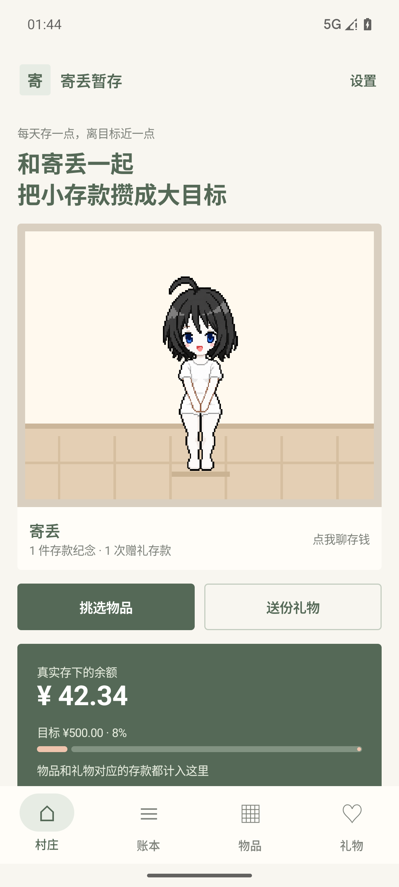
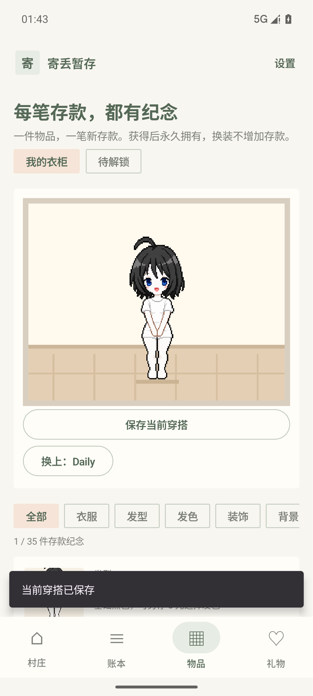
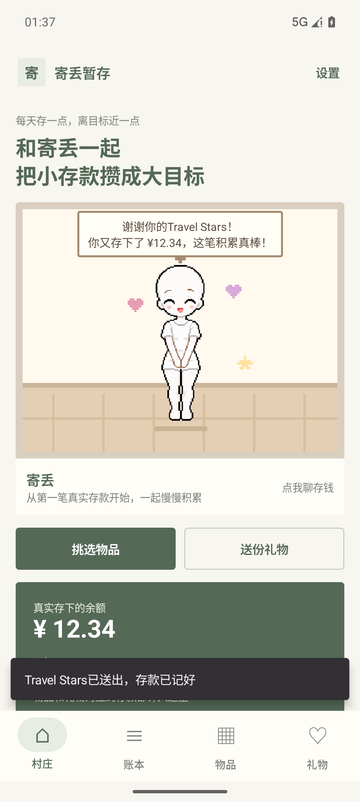

# 寄丢暂存 · Jidiu SaveMoney


**每天存一点，离目标近一点。**

寄丢暂存是一款 Android 原生的像素风存钱与记账应用。让小人「寄丢」陪你记录真实存款，把每一次积累变成装扮、礼物和成长纪念。

应用使用 **Kotlin + Jetpack Compose**，数据保存在本机。当前版本 **0.8.0**，支持 **Android 8.0 及以上**。

## 它怎么玩？

新安装从一个纯白色基础小人、一间空房和零存款记录开始。

1. 选择喜欢的物品，例如 50 元的衣服。
2. 在自己的账户里实际存下 50 元。
3. 勾选确认，应用新增一笔 50 元存款记录，并永久获得这件衣服。
4. 以后自由换装，不需要再次存钱，也不会扣除余额。

**物品和礼物都是存钱的纪念。** 资金始终留在你自己的账户；应用负责记录，不代收、支付或转移资金。已经记过的旧存款不会自动解锁物品，获取每件物品、每次赠礼都需要确认一笔新的对应金额存款。

## 功能

### 存钱与记账

- 记录收入、支出、存入储蓄和取出储蓄。
- 查看账本、本月收支、储蓄余额和目标进度。
- 设置寄丢的名字与储蓄目标。
- 删除错误记录后重新计算余额；拒绝让后续取出记录出现负余额的操作。
- 已获得物品和赠礼纪念永久保留，取出存款或更正原记录不会收回物品。

### 衣柜与房间

- **35 件物品**：7 种发型、7 套服饰、7 款发型选色资格，以及装饰、背景和家具。
- 「我的衣柜」与「待解锁」分开查看，预览当前搭配。
- 每个发型默认黑色；为该发型新存一次 **5 元**，永久解锁栗棕、樱粉、银色与基础黑色的自由切换。
- 已解锁选色的发型可以直接在卡片上换色。
- 保存最多 **20 套穿搭**，一键恢复衣服、发型、发色和装饰，保留房间布置。
- 多件家具可以同时使用，获得后可以自由摆上或收起。

### 礼物与陪伴

| 礼物 | 每次对应的新存款 |
| --- | ---: |
| 鼓励小花 | ¥5 |
| 存钱礼盒 | ¥10 |
| 庆祝蛋糕 | ¥20 |
| 成长手账 | ¥30 |
| 星星存钱罐 | ¥50 |
| 坚持奖杯 | ¥100 |

- 礼物可重复赠送，每次记录一笔新的对应金额存款。
- 创建最多 **30 种自定义礼物**，填写名称和单次存款金额；创建礼物本身不记账。
- 点击寄丢可以聊存钱；赠礼或获得物品后，寄丢会轻跳、闭眼庆祝，并通过气泡回应本次存款。
- 人物使用透明 PNG 素材合成，保留像素边缘；发色、服饰、装饰可以组合。

### 本地备份

在「设置」中选择「导出备份」或「导入备份」。

备份为 JSON 文件，包含账本、设置、物品所有权、装备、发色、赠礼记录、自定义礼物和保存的穿搭。文件位置由 Android 系统文件选择器选择，支持最大 **5 MB** 的完整备份。

恢复前显示记录数量并确认替换；恢复验证失败时，整个操作回滚，原数据保持不变。换手机或卸载前，请先导出备份并保存好文件。当前没有自动云同步。

## 界面预览

以下为模拟器中的演示记录，新安装的余额为零。

<p>
  
  
  
</p>

## 开发与运行

### 环境

- JDK 17。
- Android SDK Platform 36、Build Tools 36.1.0。
- Android Studio 或命令行开发环境。
- 项目自带 Gradle Wrapper。

克隆仓库，用 Android Studio 打开仓库根目录，等待 Gradle 同步完成。

命令行构建时，在根目录创建未提交的 `local.properties`，填写本机 SDK 路径。例如 Windows：

```properties
sdk.dir=C\:/Users/your-name/AppData/Local/Android/Sdk
```

### 构建安装包

Windows PowerShell：

```powershell
.\gradlew.bat :app:assembleDebug
```

macOS / Linux：

```bash
bash ./gradlew :app:assembleDebug
```

APK 输出到 `app/build/outputs/apk/debug/app-debug.apk`。连接 Android 手机并开启 USB 调试后，可以执行：

```powershell
adb install -r app/build/outputs/apk/debug/app-debug.apk
```

这是开发测试构建。覆盖已有应用时，需要保持相同的应用标识和签名；在另一台电脑生成的调试签名可能不同。应用标识为 `com.jidiu.companion`。

## 验证

金额与规则测试、Android 静态检查：

```powershell
.\gradlew.bat :app:testDebugUnitTest :app:lintDebug
```

Android 数据与素材检查使用独立数据库，不改动正常账本：

```powershell
.\gradlew.bat :app:assembleDebug :app:assembleDebugAndroidTest
adb install -r app/build/outputs/apk/debug/app-debug.apk
adb install -r app/build/outputs/apk/androidTest/debug/app-debug-androidTest.apk
adb shell am instrument -w com.jidiu.companion.test/com.jidiu.companion.VillageInstrumentation
```

0.8.0 已通过 **10 项金额规则测试、23 项 Android 检查**，以及自定义赠礼、文件备份恢复、保存与使用穿搭的实际页面验证。Android lint 无错误。检查记录见 [验证说明](previews/validation-v0.8.0.md)。

## 项目结构

```text
app/src/main/java/com/jidiu/companion/
  CompanionApp.kt          页面与交互
  CompanionFeatures.kt     存钱回应、自定义礼物、穿搭、备份入口
  CompanionStore.kt        SQLite 存储、升级、备份与恢复
  Money.kt                 金额规则、物品和礼物定义
  CharacterArt.kt          人物素材合成与发色
  RoomScene.kt             像素场景、物品和礼物预览
app/src/main/assets/characters/  人物 PNG 图层
app/src/main/res/                图标与主题
app/src/test/                   金额规则测试
app/src/androidTest/            Android 数据与素材检查
gradle/wrapper/                 Gradle Wrapper
previews/                       当前版本截图与验证说明
```

本机配置、构建产物、签名文件、缓存、演示数据库、旧安装包和素材草稿不纳入源码仓库。
